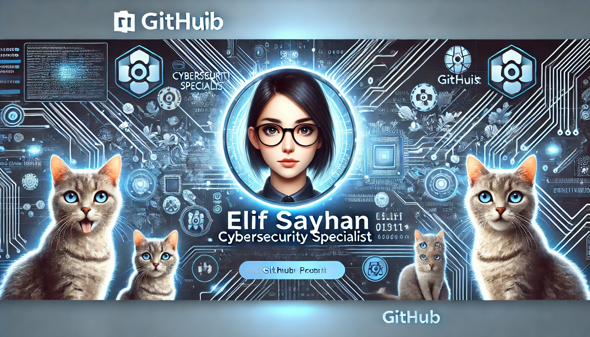

<h1 align="center">Hi 👋, I'm Elif SAYHAN</h1>
<h3 align="center">Cyber Security / En Recherche d'Alternance</h3>

  

- 🐍 Project Python [tictactoe game](https://github.com/Elif-Sayhan/Tic-Tac-Game-of-Group-Sun)

- 📧 How to reach me **elif.sayhan@laplateforme.io**

- 🌏 Project Website [fansite](https://github.com/Elif-Sayhan/Fansite-of-the-group-star)

- 📚 I'm learning currently [Problem Solving and Python Programming,](https://www.shiksha.com/it-software/cyber-security-syllabus-chp)

<h3 align="left">Connect with me:</h3>

<h3 align="left">Languages and Tools:</h3>

    

&nbsp;

